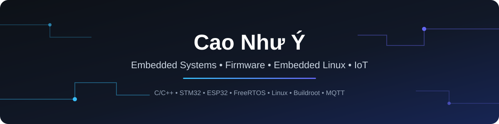

<div align="center">



<br><br>

<a href="https://git.io/typing-svg">
  
</a>

<br>

[](https://github.com/NYCser)
[](mailto:ycao800@gmail.com)
[](https://github.com/NYCser)

</div>

<br>

## 👋 About Me

- Currently building **multi-node IoT / smart-home gateway systems**
- Focused on **Firmware Development, Embedded Linux, and IoT architecture**
- Working daily with **STM32, ESP32, Raspberry Pi, and FreeRTOS**


<br>

## Tech Stack

<div align="center">

**Languages**


**Embedded & Firmware**


**Embedded Linux**


**Protocols & Messaging**


**Data, Cloud & Tools**


</div>

<br>
## Current Focus

```text
                    Embedded C/C++
                         │
                         ▼
              Microcontroller Firmware
                         │
                 ┌───────┴───────┐
                 ▼               ▼
              STM32            ESP32
                 │               │
                 └───────┬───────┘
                         ▼
                   FreeRTOS / Drivers
                         │
                         ▼
                Communication Protocols
              UART • SPI • I2C • MQTT
                         │
                         ▼
                  Embedded Linux
                         │
                    Buildroot
                         │
                         ▼
                    Edge / IoT Systems
```

<br>

## GitHub Stats

<div align="center">


<br>


</div>

<br>

<div align="center">

### Let's Connect

[](https://github.com/NYCser)
[](mailto:ycao800@gmail.com)

<br>


</div>
